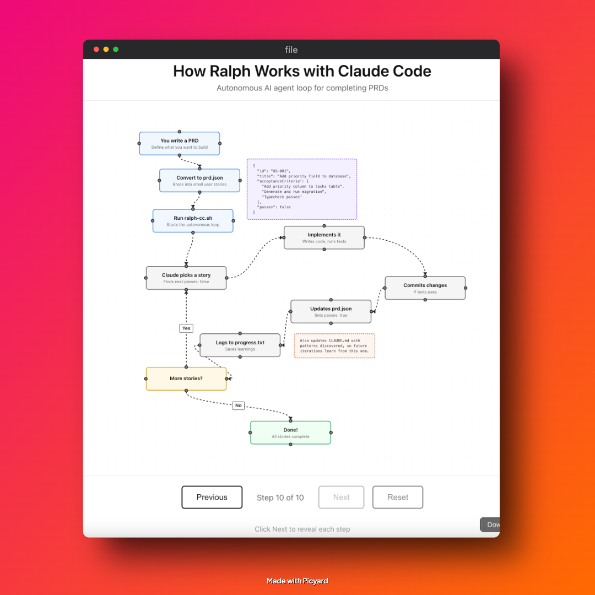

# Ralph for Claude Code

Ralph is an autonomous AI agent loop that runs [Claude Code](https://claude.com/claude-code) repeatedly until all PRD items are complete. Each iteration is a fresh Claude Code instance with clean context. Memory persists via git history, `progress.txt`, and `prd.json`.

This is a Claude Code adaptation of [Ralph](https://github.com/snarktank/ralph), originally based on [Geoffrey Huntley's Ralph pattern](https://ghuntley.com/ralph/).

## Prerequisites

- [Claude Code CLI](https://claude.com/claude-code) installed and authenticated
- `jq` installed (`brew install jq` on macOS)
- A git repository for your project

## Setup

### Option 1: Copy to your project

Copy the ralph-ryan-cc files into your project:

```bash
# From your project root
mkdir -p scripts/ralph
cp /path/to/ralph-ryan-cc/ralph-cc.sh scripts/ralph/
cp /path/to/ralph-ryan-cc/prompt.md scripts/ralph/
chmod +x scripts/ralph/ralph-cc.sh
```

### Option 2: Use with ralph-ryan skill

If you have the `ralph-ryan` Claude Code skill installed, you can use it for PRD generation and execution within Claude Code:

```
use ralph-ryan skill, write prd for [feature]
use ralph-ryan skill, prepare files
use ralph-ryan skill, run
```

## Workflow

### 1. Create a PRD

Create a `prd.json` file in the ralph directory. Use `prd.json.example` as a template:

```bash
cp prd.json.example prd.json
# Edit prd.json with your user stories
```

Or use the ralph-ryan skill to generate one interactively.

### 2. Run Ralph

```bash
./ralph-cc.sh [max_iterations]
```

Default is 10 iterations.

Ralph will:
1. Create a feature branch (from PRD `branchName`)
2. Pick the highest priority story where `passes: false`
3. Implement that single story
4. Run quality checks (typecheck, tests)
5. Commit if checks pass
6. Update `prd.json` to mark story as `passes: true`
7. Append learnings to `progress.txt`
8. Save iteration output to `iterations/`
9. Repeat until all stories pass or max iterations reached

## Key Files

| File | Purpose |
|------|---------|
| `ralph-cc.sh` | The bash loop that spawns fresh Claude Code instances |
| `prompt.md` | Instructions given to each Claude Code instance |
| `prd.json` | User stories with `passes` status (the task list) |
| `prd.json.example` | Example PRD format for reference |
| `progress.txt` | Append-only learnings for future iterations |
| `iterations/` | Conversation exports from each iteration |
| `CLAUDE.md` | Agent instructions and patterns |
| `flowchart/` | Interactive visualization of how Ralph works |

## Flowchart

[](https://rajat-goyal.github.io/ralph-ryan-cc/)

**[View Interactive Flowchart](https://rajat-goyal.github.io/ralph-ryan-cc/)** - Click through to see each step with animations.

The `flowchart/` directory contains the source code. To run locally:

```bash
cd flowchart
npm install
npm run dev
```

**Key insight:** Each iteration spawns a **fresh Claude Code instance** with no memory. Context persists only through files (git, progress.txt, prd.json, iterations/).

## Critical Concepts

### Each Iteration = Fresh Context

Each iteration spawns a **new Claude Code instance** with clean context. The only memory between iterations is:
- Git history (commits from previous iterations)
- `progress.txt` (learnings and context)
- `prd.json` (which stories are done)
- `iterations/` (conversation exports for reference)

### Small Tasks

Each PRD item should be small enough to complete in one context window. If a task is too big, the LLM runs out of context before finishing and produces poor code.

Right-sized stories:
- Add a database column and migration
- Add a UI component to an existing page
- Update a server action with new logic
- Add a filter dropdown to a list

Too big (split these):
- "Build the entire dashboard"
- "Add authentication"
- "Refactor the API"

### CLAUDE.md Updates Are Critical

After each iteration, Ralph updates the relevant `CLAUDE.md` files with learnings. Claude Code automatically reads these files, so future iterations (and future human developers) benefit from discovered patterns, gotchas, and conventions.

Examples of what to add to CLAUDE.md:
- Patterns discovered ("this codebase uses X for Y")
- Gotchas ("do not forget to update Z when changing W")
- Useful context ("the settings panel is in component X")

### Feedback Loops

Ralph only works if there are feedback loops:
- Typecheck catches type errors
- Tests verify behavior
- CI must stay green (broken code compounds across iterations)

### Browser Verification for UI Stories

Frontend stories must include "Verify in browser using Playwright MCP" in acceptance criteria. Ralph will use browser automation to navigate to the page, interact with the UI, and confirm changes work.

### Stop Condition

When all stories have `passes: true`, Ralph outputs `<promise>COMPLETE</promise>` and the loop exits.

## Debugging

Check current state:

```bash
# See which stories are done
cat prd.json | jq '.userStories[] | {id, title, passes}'

# See learnings from previous iterations
cat progress.txt

# Check git history
git log --oneline -10

# View iteration exports
ls -la iterations/
```

## Customizing prompt.md

Edit `prompt.md` to customize Ralph's behavior for your project:
- Add project-specific quality check commands
- Include codebase conventions
- Add common gotchas for your stack

## Archiving

Ralph automatically archives previous runs when you start a new feature (different `branchName`). Archives are saved to `archive/YYYY-MM-DD-feature-name/`.

## Differences from Amp Version

| Aspect | Amp Version | Claude Code Version |
|--------|-------------|---------------------|
| CLI command | `amp --dangerously-allow-all` | `claude --dangerously-skip-permissions --print` |
| Pattern docs | `AGENTS.md` | `CLAUDE.md` |
| Thread references | `$AMP_CURRENT_THREAD_ID` URLs | `iterations/` file exports |
| Browser testing | `dev-browser` skill | Playwright MCP |
| Skills location | `~/.config/amp/skills/` | Use `ralph-ryan` skill |

## Testing

### Quick Verification

To verify Ralph is set up correctly:

```bash
# Check prerequisites
command -v claude && echo "claude CLI: OK" || echo "claude CLI: MISSING"
command -v jq && echo "jq: OK" || echo "jq: MISSING"

# Check script syntax
bash -n ralph-cc.sh && echo "Script syntax: OK"

# Dry run (will fail if no prd.json, but confirms script runs)
./ralph-cc.sh 1
```

### Running a Test PRD

Use the provided `test-prd.json` to verify Ralph works end-to-end:

```bash
# Copy test PRD
cp test-prd.json prd.json

# Run with 3 iterations max
./ralph-cc.sh 3
```

### Sample Test PRD

A minimal test PRD (`test-prd.json`) is included:

```json
{
  "project": "Ralph Test",
  "featureName": "test-run",
  "branchName": "ralph/test-run",
  "description": "Test PRD to verify Ralph works correctly",
  "userStories": [
    {
      "id": "TEST-001",
      "title": "Create test file",
      "description": "Create a simple test file to verify Ralph execution",
      "acceptanceCriteria": [
        "Create file `ralph-test-output.txt` with content 'Ralph works!'",
        "File exists and contains expected content"
      ],
      "priority": 1,
      "passes": false,
      "notes": "Simple test to verify basic functionality"
    }
  ]
}
```

### Expected Behavior

When Ralph runs successfully:

1. **Startup**: Shows "Ralph for Claude Code" banner and validation checks
2. **Iteration**: Shows iteration number and spawns Claude Code
3. **Work**: Claude Code reads PRD, implements story, commits
4. **Progress**: Updates `prd.json` and `progress.txt`
5. **Completion**: Shows `<promise>COMPLETE</promise>` when all stories pass

### Success Criteria

- [ ] Script starts without errors
- [ ] Validation checks pass (claude CLI, jq, prd.json)
- [ ] Claude Code spawns and receives prompt
- [ ] Story gets implemented and committed
- [ ] `prd.json` updated with `passes: true`
- [ ] `progress.txt` updated with learnings
- [ ] Iteration output saved to `iterations/`

### Troubleshooting

**"command not found: claude"**
- Install Claude Code CLI: https://claude.com/claude-code
- Ensure it's in your PATH

**"command not found: jq"**
- Install jq: `brew install jq` (macOS) or `apt install jq` (Linux)

**"prd.json not found"**
- Copy the example: `cp prd.json.example prd.json`
- Or copy test PRD: `cp test-prd.json prd.json`

**"prd.json is not valid JSON"**
- Validate with: `jq . prd.json`
- Check for trailing commas, missing quotes, etc.

**"All stories already pass"**
- Reset stories: `jq '.userStories[].passes = false' prd.json > tmp.json && mv tmp.json prd.json`

**Claude Code hangs or times out**
- Check Claude Code authentication: `claude --version`
- Try running Claude Code directly: `echo "Hello" | claude --print`

**Iteration completes but story not marked as passed**
- Check `progress.txt` for errors
- Review iteration output in `iterations/`
- Story may have failed quality checks

## Changes from Original Ralph

Key changes made while porting from [snarktank/ralph](https://github.com/snarktank/ralph):

- Replaced `amp --dangerously-allow-all` with `claude --dangerously-skip-permissions --print`
- Changed `AGENTS.md` convention to `CLAUDE.md` (Claude Code standard)
- Replaced `$AMP_CURRENT_THREAD_ID` thread URLs with `iterations/` file exports
- Updated browser testing from `dev-browser` skill to Playwright MCP
- Added validation functions for prerequisites and PRD format
- Added early exit when all stories already pass
- Removed `autoHandoff` references (Claude Code handles context differently)
- Added `featureName` field to PRD for archive folder naming

## Credits

This project is a Claude Code port of [Ralph](https://github.com/snarktank/ralph) by [Ryan Carniato](https://github.com/ryansolid) (snarktank), which was inspired by [Geoffrey Huntley's Ralph pattern](https://ghuntley.com/ralph/).

The name **ralph-ryan** is a tribute to both:
- **Ralph** - the autonomous agent architecture pattern
- **Ryan** - the author of the original snarktank/ralph implementation

## References

- [Original Ralph repository](https://github.com/snarktank/ralph)
- [Geoffrey Huntley's Ralph article](https://ghuntley.com/ralph/)
- [Claude Code documentation](https://claude.com/claude-code)
